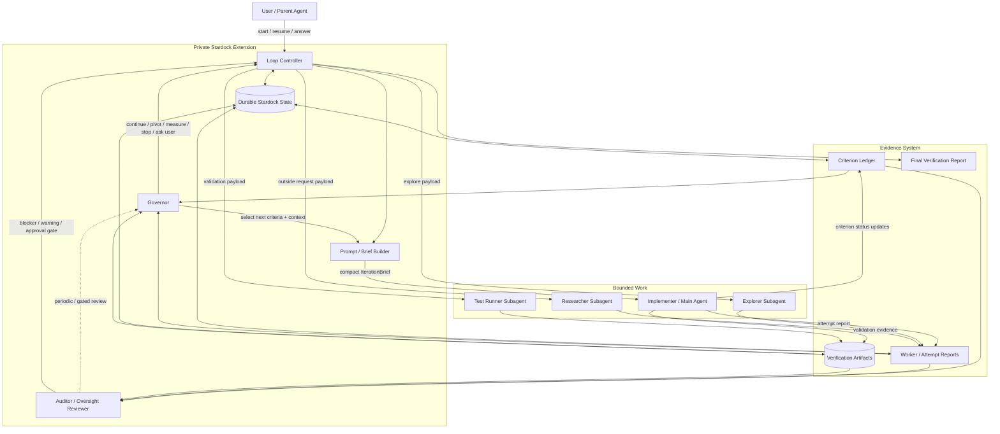
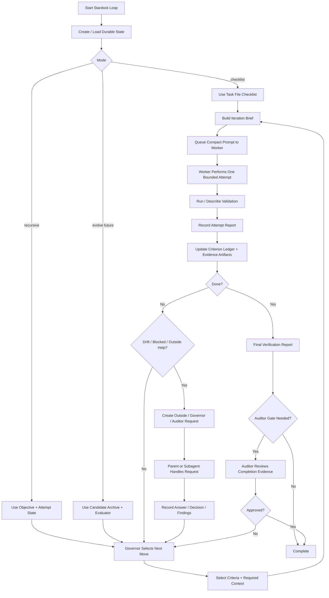
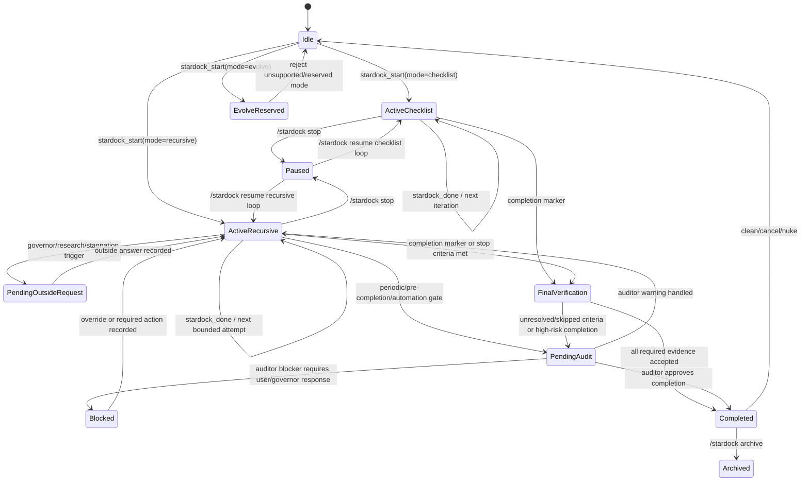
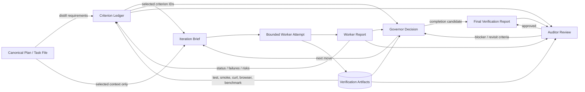
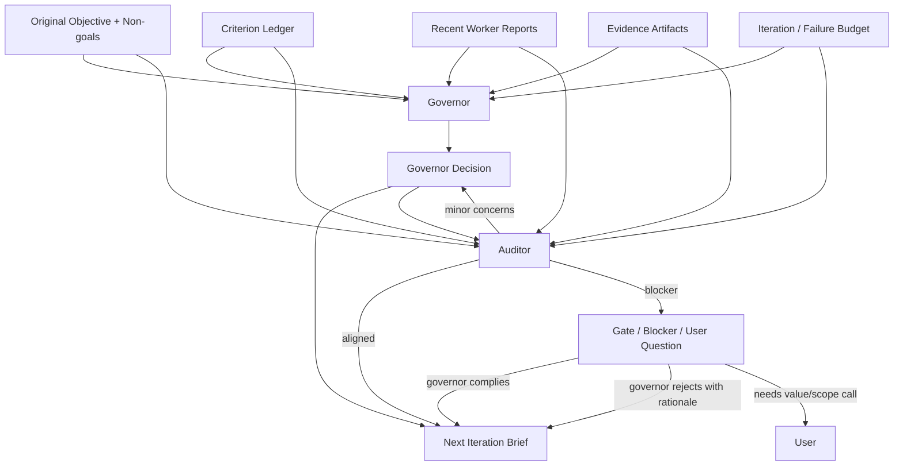
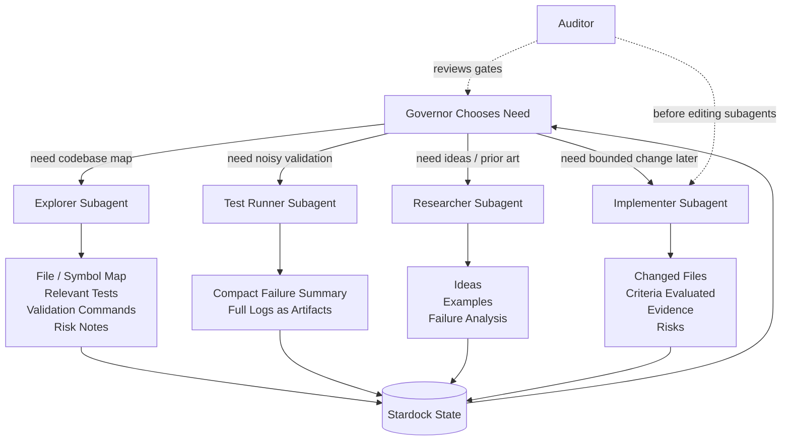
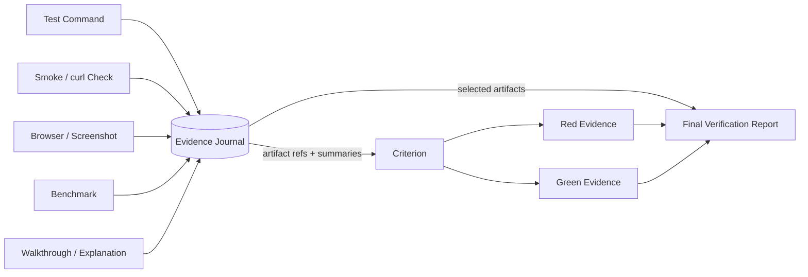
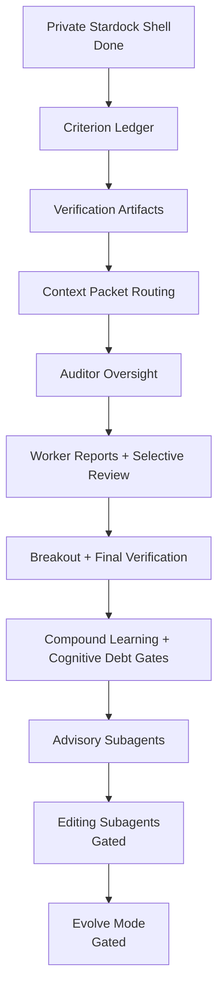

# Stardock architecture diagrams

These diagrams describe Stardock's target architecture and current private implementation direction. The private extension provides checklist and recursive loops, structured attempt reports, governor/outside request payloads, criterion ledgers, verification artifacts, iteration briefs, final reports, auditor reviews, advisory handoffs, breakout packages, worker reports, read-only policy recommendations, and local `.stardock/` state. Direct subagent execution and evolve mode remain planned design gates.

## High-level architecture



## Core loop flow



## Loop state machine



## Data flow: plan to criteria to evidence to completion



## Governor and auditor split



## Subagent role flow



## Evidence and artifact model



## Planned evolution phases



## Summary flow

```text
Plan
  ↓
Criterion Ledger
  ↓
Governor selects next criteria/context
  ↓
Worker gets compact brief
  ↓
Worker produces report + evidence
  ↓
Governor decides next move
  ↓
Auditor occasionally checks governor/gates
  ↓
Final verification or breakout
```
