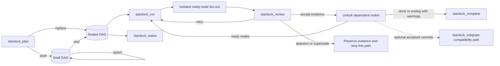
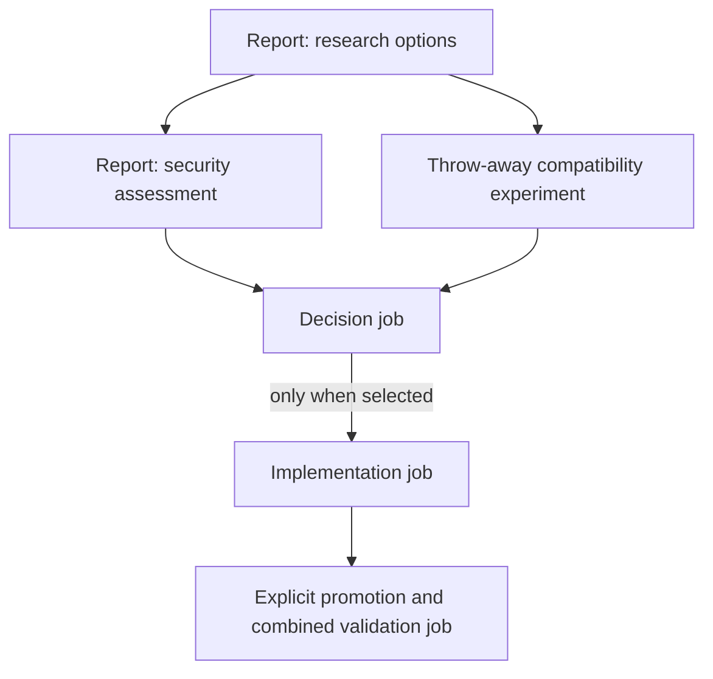
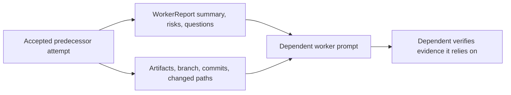
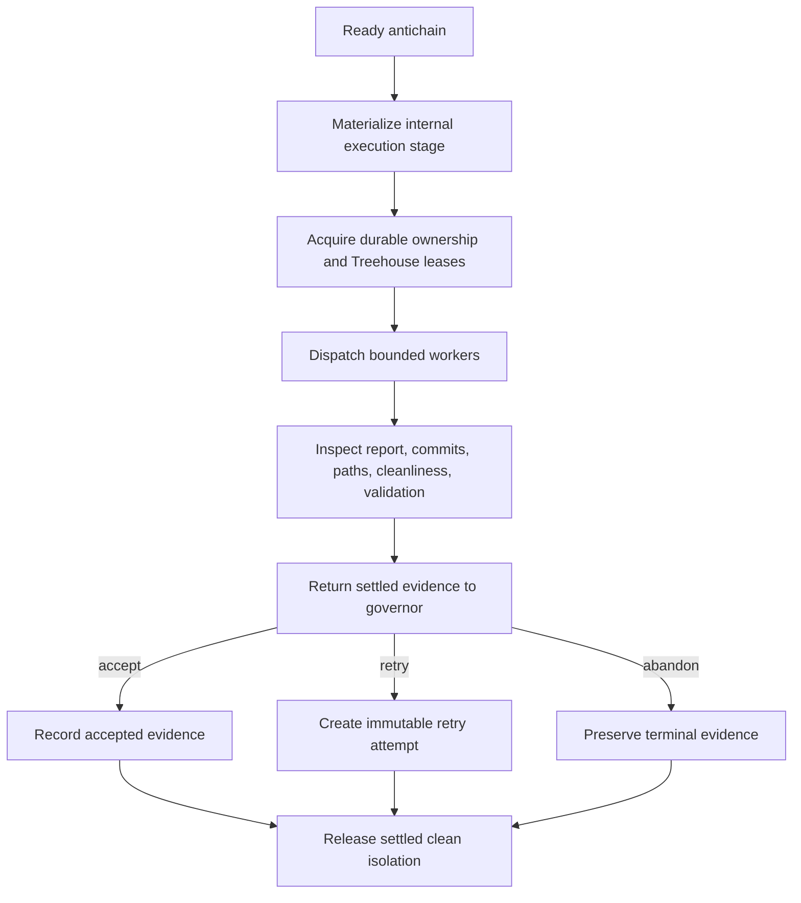
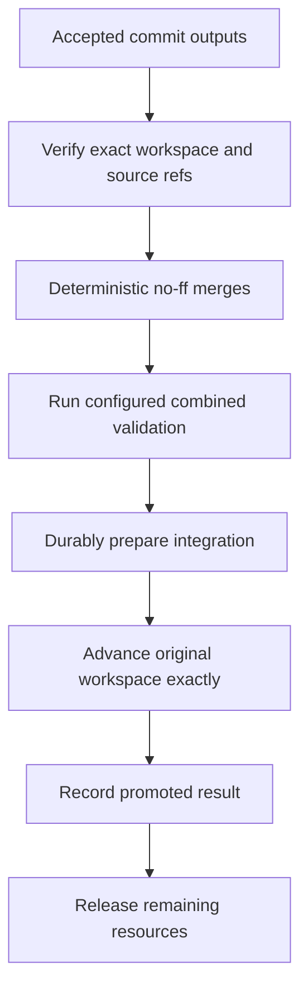
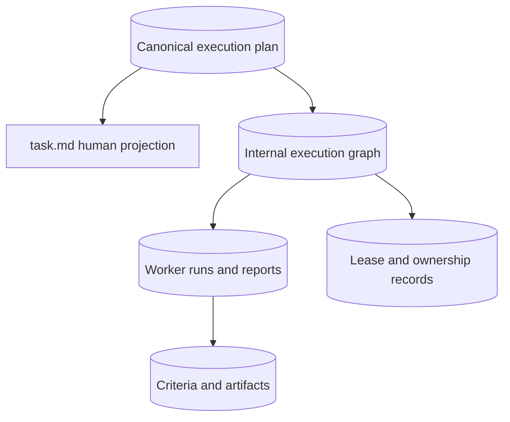

# Stardock architecture

Stardock exposes a governor-controlled DAG while retaining worker isolation, leases, Git identity, evidence, cleanup, and recovery below that boundary.
DAG nodes are arbitrary jobs, not PRs or mandatory code producers.
Accepted evidence unlocks dependencies; integration is an explicit node or an optional compatibility operation.

## Governor-facing flow


```mermaid
flowchart LR
  Plan[stardock_plan] -->|replace| DAG[(Sealed DAG)]
  Plan -->|draft| Draft[(Draft DAG)]
  Draft -->|upsert| Draft
  Draft -->|seal| DAG
  DAG --> Run[stardock_run]
  Run --> Workers[Isolated ready-node fan-out]
  Workers --> Review[stardock_review]
  Review -->|accept evidence| Unlock[Unlock dependent nodes]
  Unlock -->|ready nodes| Run
  Review -->|retry| Run
  Review -->|abandon or supersede| Stop[Preserve evidence and stop this path]
  Unlock -->|done or ending with warnings| Complete[stardock_complete]
  Unlock -.->|optional accepted commits| Integrate[stardock_integrate compatibility path]
  DAG --> Status[stardock_status]
```

The governor sees objectives, dependencies, settled reports, risks, warnings, attempt history, and available actions.
Stardock does not own the semantic choice to accept, retry, abandon, supersede, integrate, or complete.
It does own mechanical safety checks such as exact Git identity, clean lease return, append-only attempt records, and durable state transitions.

## DAG activity projection

The persistent widget is a compact topological list, not a tree ownership model.
Each row carries dependency context, status, worker/tool activity when available, and elapsed time.
Durable plan state owns node and dependency status; worker bridge updates add transient activity only.

```text
stardock <name> (<node count>)
┊ DAG · wave <n> · <running> agents running · <resolved>/<total> resolved · next <action>
├ <status> <node> · <activity> · ← <dependencies>
└ <status> <node> · pending · after <dependencies>
```

## Arbitrary jobs and explicit combination


```mermaid
flowchart TD
  Research[Report: research options] --> Security[Report: security assessment]
  Research --> Experiment[Throw-away compatibility experiment]
  Security --> Decide[Decision job]
  Experiment --> Decide
  Decide -->|only when selected| Implement[Implementation job]
  Implement --> Promote[Explicit promotion and combined validation job]
```

A prerequisite is an executable job whose accepted output is needed by dependents.
Once accepted, all dependency-free children become one ready antichain and run with bounded concurrency.
A node may produce only a report or artifacts; writes and validation commands are optional.
Promotion is visible in the graph when it matters rather than being inferred after every accepted wave.

## Dependency communication


```mermaid
flowchart LR
  Prior[Accepted predecessor attempt] --> Report[WorkerReport summary, risks, questions]
  Prior --> Refs[Artifacts, branch, commits, changed paths]
  Report --> Prompt[Dependent worker prompt]
  Refs --> Prompt
  Prompt --> Verify[Dependent verifies evidence it relies on]
```

Dependent workers receive bounded predecessor handoffs.
They are told that prior filesystem changes are not automatically present in a new isolated lease, so an explicit combination job can use recorded branch and commit identities without hidden workspace coupling.

## Internal worker lifecycle


```mermaid
flowchart TD
  Ready[Ready antichain] --> Materialize[Materialize internal execution stage]
  Materialize --> Lease[Acquire durable ownership and Treehouse leases]
  Lease --> Dispatch[Dispatch bounded workers]
  Dispatch --> Inspect[Inspect report, commits, paths, cleanliness, validation]
  Inspect --> Review[Return settled evidence to governor]
  Review -->|accept| Accepted[Record accepted evidence]
  Review -->|retry| Retry[Create immutable retry attempt]
  Review -->|abandon| Abandoned[Preserve terminal evidence]
  Accepted --> Cleanup[Release settled clean isolation]
  Retry --> Cleanup
  Abandoned --> Cleanup
```

Each plan node maps internally to a generated brief, criterion, execution node, WorkerRun, WorkerReport, and immutable attempt.
These records support reliability and recovery; they are not extra governor tasks.
Failed checks, no-edit outcomes, and attempt exhaustion remain visible as advisory evidence.

## Optional convenience integration


```mermaid
flowchart TD
  Accepted[Accepted commit outputs] --> Preflight[Verify exact workspace and source refs]
  Preflight --> Merge[Deterministic no-ff merges]
  Merge --> Validate[Run configured combined validation]
  Validate --> Prepare[Durably prepare integration]
  Prepare --> FastForward[Advance original workspace exactly]
  FastForward --> Record[Record promoted result]
  Record --> Release[Release remaining resources]
```

This lifecycle is exposed through `stardock_integrate` for persisted plans that choose the compatibility path.
It is not a universal transition and is never required for report-only, diagnostic, research, decision, or throw-away experiment nodes.
Failures stop at a safe boundary and retain enough state for retry or recovery.

## State ownership


```mermaid
flowchart TB
  Plan[(Canonical execution plan)]
  Projection[task.md human projection]
  Graph[(Internal execution graph)]
  Runs[(Worker runs and reports)]
  Evidence[(Criteria and artifacts)]
  Ownership[(Lease and ownership records)]

  Plan --> Projection
  Plan --> Graph
  Graph --> Runs
  Runs --> Evidence
  Graph --> Ownership
```

The execution plan is the governor-facing source of truth.
The task file is generated.
Internal graph, worker, evidence, and ownership records remain append-only or guarded where recovery requires it.
Supersession preserves prior evidence and attempts best-effort release of clean inactive leases.

## Compatibility boundary

Legacy Stardock tools and schema-v3 evidence collections remain registered for existing state and exceptional diagnostics.
They are inactive by default for new plans.
Resuming a planless legacy loop restores its required surface, while `/stardock-legacy on` exposes it manually for the current session.
New DAG execution uses plan, run, review, status, and completion; integration is available only when the governor explicitly chooses it.
