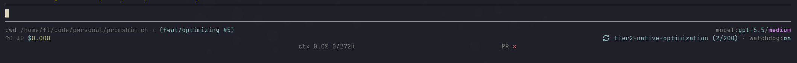

# pi-footer-framework

Configurable footer replacement for Pi. It owns footer layout, formatting, color, truncation, and placement while other extensions publish structured status/data for it to render.

Use it when you want to customize Pi's footer through a configurable framework that agents can inspect and reconfigure from natural-language prompts.

## Install

```bash
pi install npm:@badliveware/pi-footer-framework
```

No external services or credentials are required.

## Quick use

```text
/footerfx on
/footerfx item context line 1
/footerfx item context after model
/footerfx item pr line 3
/footerfx anchor all right
/footerfx save user
```

The default layout uses two footer lines. If you place an item on another positive line number, the footer grows to include that line. Disable the replacement footer with:

```text
/footerfx off
```

## Showcase

This is a real Pi terminal using templates, theme-aware styles, right-anchored layout, fixed-column placement, PR state, and an adapted extension status item:



The screenshot demonstrates:

- combined template output: cwd plus branch/PR label in one item
- token-level styling: labels, model id, thinking level, token stats, context, and cost use different Pi theme colors/attributes
- built-in Pi data: `cwd`, `branch`, `model`, `stats`, `context`, and `pr`
- extension status adaptation: `compaction-continue` status becomes `watchdog:on`
- flexible placement: line 1 and line 2 are right-anchored, while line 3 uses fixed `column` placement for middle and center-right items

<details>
<summary>Config used for the screenshot</summary>

Save this as `~/.pi/agent/footer-framework.json` or adapt it with `footer_framework_adapter_config`:

```json
{
  "enabled": true,
  "lineAnchors": {
    "1": "right",
    "2": "right",
    "3": "left"
  },
  "minGap": 2,
  "maxGap": 24,
  "items": {
    "branch": { "visible": false },
    "ext": { "visible": false }
  },
  "adapters": {
    "cwd": {
      "source": "pi",
      "key": "cwd",
      "itemId": "cwd",
      "urlPath": "url",
      "template": "{{ \"cwd\" | style: \"muted\" }} {{ pi.cwd | compactPath: 48, 2 | style: \"dim\" }}{{ \" · \" | style: \"muted\" }}{{ pi.branch.label | default: \"\" | truncate: 22 | style: \"accent\" }}",
      "placement": { "visible": true, "line": 1, "zone": "left", "order": 10 }
    },
    "model": {
      "source": "pi",
      "key": "model",
      "itemId": "model",
      "urlPath": "url",
      "template": "{{ \"model:\" | style: \"muted\" }}{{ pi.model.id | style: \"accent\" }}{{ \"/\" | style: \"muted\" }}{{ pi.model.thinking | style: \"thinkingXhigh,bold\" }}",
      "placement": { "visible": true, "line": 1, "zone": "right", "order": 10 }
    },
    "stats": {
      "source": "pi",
      "key": "stats",
      "itemId": "stats",
      "urlPath": "url",
      "template": "{{ \"↑\" | style: \"dim\" }}{{ pi.stats.inputText | style: \"dim\" }} {{ \"↓\" | style: \"dim\" }}{{ pi.stats.outputText | style: \"dim\" }} {{ \"$\" | style: \"accent\" }}{{ pi.stats.costText | style: \"success\" }}",
      "placement": { "visible": true, "line": 2, "zone": "left", "order": 10 }
    },
    "context": {
      "source": "pi",
      "key": "context",
      "itemId": "context",
      "urlPath": "url",
      "template": "{{ \"ctx\" | style: pi.context.tone }} {{ pi.context.percentText | style: pi.context.tone }} {{ pi.context.tokenText | style: pi.context.tone }}",
      "placement": { "visible": true, "line": 3, "zone": "left", "order": 10, "column": 78 }
    },
    "pr": {
      "source": "pi",
      "key": "pr",
      "itemId": "pr",
      "urlPath": "url",
      "template": "{{ \"PR \" | style: \"muted\" }}{{ pi.pr.checkGlyph | style: pi.pr.checkTone }}{{ pi.pr.commentsText | style: \"muted\" }}",
      "placement": { "visible": true, "line": 3, "zone": "left", "order": 20, "column": 132 }
    },
    "watchdog": {
      "source": "extensionStatus",
      "key": "compaction-continue",
      "itemId": "watchdog",
      "match": "(on|off)",
      "group": 1,
      "urlPath": "url",
      "template": "{{ \"watchdog:\" | style: \"muted\" }}{{ value | style: \"accent,bold\" }}",
      "placement": { "visible": true, "line": 2, "zone": "right", "order": 20 }
    }
  }
}
```

Fixed `column` positions are terminal-width dependent; adjust them for narrower terminals.

</details>

## How it works

Footer-framework renders normalized footer items from three adapter sources:

| Source | Use it for |
| --- | --- |
| `pi` | Built-in Pi/session/footer data such as `cwd`, `model`, `stats`, `context`, `branch`, `pr`, and `extensionStatuses`. |
| `extensionStatus` | Existing `ctx.ui.setStatus()` footer/status entries from other extensions. |
| `sessionEntry` | The latest custom session entry written by an extension with `pi.appendEntry()`. |

The built-in footer items (`cwd`, `model`, `branch`, `stats`, `context`, `pr`) use the same adapter path as user-defined items. User/project config overrides built-in defaults and producer hints.

Agents can inspect concise footer-relevant data with `footer_framework_sources`, then add adapter rules with `footer_framework_adapter_config`. Runtime metadata such as tools, commands, skills, descriptions, and `sourceInfo` is opt-in via `includeTools`, `includeCommands`, `includeSkills`, and `includeDetails`.

## Templates and styles

Adapters can render with a restricted Liquid-style interpolation subset:

```liquid
{{ pi.stats.costText }}
{{ "EUR" }}
{{ "EUR" | style: "accent" }}{{ pi.stats.costText | style: "success,bold" }}
```

Quoted strings are literals. Unquoted terms are variables, so missing variables are reported as template diagnostics instead of being guessed as text. Diagnostics appear in `/footerfx-debug`, `footer_framework_state`, and `footer_framework_sources`.

Useful template context:

| Path | Meaning |
| --- | --- |
| `value`, `label`, `status`, `data`, `url` | The current adapter source. |
| `pi.cwd` | Current working directory. |
| `pi.model.id`, `pi.model.provider`, `pi.model.thinking` | Current model information. |
| `pi.stats.inputText`, `pi.stats.outputText`, `pi.stats.costText` | Formatted session token/cost stats. Raw numbers are `input`, `output`, and `cost`. |
| `pi.context.percentText`, `pi.context.tokenText`, `pi.context.tone` | Context usage and recommended tone. |
| `pi.branch.name`, `pi.branch.label` | Git branch values. Use `truncate` in templates when you want a shorter display. |
| `pi.pr.number`, `pi.pr.url`, `pi.pr.checkGlyph`, `pi.pr.checkTone`, `pi.pr.commentsText` | Pull request state when available. |

Supported filters:

| Filter | Example |
| --- | --- |
| `style` / `color` | `{{ value | style: "accent,bold" }}` |
| `bg` / `background` | `{{ value | bg: "toolSuccessBg" }}` |
| `bold`, `italic`, `underline`, `inverse`, `strikethrough` | `{{ value | underline }}` |
| `link` | `{{ pi.pr.number | link: pi.pr.url }}` |
| `truncate` | `{{ pi.branch.label | truncate: 22 }}` limits any value to 22 cells with an ellipsis. |
| `compactPath` | `{{ pi.cwd | compactPath: 48, 2 }}` keeps the last 2 path segments when the path is wider than 48 cells. |
| `default` | `{{ data.state | default: "unknown" }}` |

Style strings use Pi theme tokens and text attributes. Foreground examples: `accent`, `muted`, `dim`, `success`, `warning`, `error`, `text`, `mdLink`, `toolDiffAdded`, and the other Pi theme foreground tokens. Backgrounds use `bg:<token>`, such as `bg:toolSuccessBg`. Attributes are `bold`, `italic`, `underline`, `inverse`, and `strikethrough`.

## Configuration files

User settings persist to:

```text
~/.pi/agent/footer-framework.json
```

Project settings can override them:

```text
<project>/.pi/footer-framework.json
```

Use `/footerfx save project` only when you intentionally want a project-specific footer layout.

## Commands

| Command | What it does |
| --- | --- |
| `/footerfx` | Show current config and source. |
| `/footerfx on` / `/footerfx off` | Enable or disable the replacement footer. |
| `/footerfx config` | Show loaded config source and config paths. |
| `/footerfx load` | Reload user/project config files. |
| `/footerfx save user` | Save current settings as the user default. |
| `/footerfx save project` | Save current settings for the current project. |
| `/footerfx reset` | Restore defaults and persist them to user config. |
| `/footerfx section <cwd|stats|context|model|branch|pr|ext> <on|off>` | Convenience alias for item visibility. |
| `/footerfx item <id> <show|hide|reset>` | Control item visibility. |
| `/footerfx item <id> line <n>` / `row <n>` | Move an item to any positive footer line. |
| `/footerfx item <id> zone <left|right>` | Move an item between left/right zones. |
| `/footerfx item <id> before <other-id>` / `after <other-id>` | Place an item relative to another item. |
| `/footerfx item <id> column <n|off>` | Pin or unpin an item at an absolute terminal column. |
| `/footerfx anchor <line|all> <gap|left|center|right|spread>` | Control line alignment. `line3` and `3` both work. |
| `/footerfx adapter` | List configured adapters. |
| `/footerfx adapter <id> pi <source-key> [label]` | Adapt a built-in Pi source. |
| `/footerfx adapter <id> status <status-key> [label]` | Adapt an existing extension status key. |
| `/footerfx adapter <id> custom <custom-type> <path> [label]` | Adapt the latest matching custom session entry. |
| `/footerfx adapter <id> template <template>` | Set the adapter's render template. |
| `/footerfx adapter <id> empty-template <template>` | Set the template used for an empty adapter value. |
| `/footerfx adapter <id> style <style>` | Apply a default style to the rendered adapter text. |
| `/footerfx adapter <id> remove` | Remove an adapter. For built-ins, hide the item with `/footerfx item <id> hide`. |
| `/footerfx gap <min> <max>` | Set spacing bounds. |
| `/footerfx-debug` | Show render snapshot, settings, template diagnostics, and layout telemetry. |

## Agent tools

The extension exposes tools so agents can inspect and adjust the footer without asking you to run commands:

- `footer_framework_state`
- `footer_framework_sources`
- `footer_framework_config`
- `footer_framework_adapter_config`

`footer_framework_sources` is concise by default. Pass `includeTools`, `includeCommands`, `includeSkills`, and `includeDetails` only when runtime metadata is directly useful.

## Extension data API

Compatible extensions should publish data, not pre-rendered layout. The framework decides final text, color, position, and truncation. Producers may include hints, but user config wins.

```ts
pi.events.emit("footer-framework:item", {
  id: "cache:status",
  label: "cache",
  value: "warm",
  tone: "success",
  data: { entries: 42 },
  hint: {
    icon: "◇",
    format: "label-value",
    placement: { line: 2, zone: "right", order: 50 }
  }
});
```

Legacy `text` and top-level `placement` fields still work for existing extensions, but new integrations should prefer `label`, `value`, `status`, `data`, and `hint`.

Remove an item with:

```ts
pi.events.emit("footer-framework:item", { id: "cache:status", remove: true });
```

## Troubleshooting

### Blank space below the footer

If blank rows sometimes appear below the footer and disappear after you send a prompt, check `/footerfx-debug` or `footer_framework_state`. When `lastFooterSnapshot.lines` contains only the expected footer lines, the framework is not rendering extra rows. This is usually Pi's TUI viewport/differential rendering leaving unused terminal space below the last rendered component.

A Pi-side workaround is `terminal.clearOnShrink: true` in `~/.pi/agent/settings.json`, but that can add redraw flicker. Footer-framework does not change this setting.
