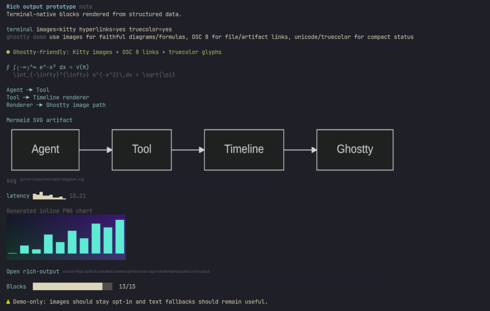

# Pi Rich Output

Rich Output adds terminal-friendly structured cards to the Pi timeline. It can show validation summaries, review findings, diagrams, charts, artifact links, progress, and small visual status blocks without turning the conversation into a wall of text.

This extension is working, but it is still WIP. I am publishing it while I evaluate whether rich timeline output is useful enough to keep and expand.



## Why use it

Use Rich Output when a result is easier to understand as a compact card than as prose:

| Content | What readers get |
| --- | --- |
| Validation summaries | Commands, results, durations, and skipped checks in one compact entry |
| Review findings | Severity, location, evidence, impact, and suggested fixes |
| Benchmark notes | Tables, sparklines, and charts for comparisons or trends |
| Diagrams | Small flow diagrams or rendered Mermaid architecture/sequence diagrams |
| Artifact links | Visible file paths with terminal hyperlinks when supported |
| Status snapshots | Badges, progress bars, key/value rows, and callouts |

For simple answers, normal text is still better.

## Install

From npm:

```bash
pi install @badliveware/pi-rich-output
```

From this repository workspace:

```bash
pi install ./agent/extensions/public/rich-output
```

## Try it

Run the demo command in Pi:

```text
/rich-output-demo
```

The demo shows the main rendering surfaces in one timeline entry: terminal capabilities, badges, a formula, a simple flow diagram, a Mermaid diagram, a sparkline, an inline image preview, an artifact link, progress, and a callout.

## Tool and command

### `/rich-output-demo`

Shows a sample rich timeline entry so you can see how the extension renders in your terminal.

### `rich_output_present`

Structured Pi tool used to add a rich card to the timeline. It accepts a card kind, title, optional summary/markdown/payload, and optional blocks such as tables, links, diagrams, charts, images, badges, progress bars, and callouts.

Most users do not need to call the tool directly; the point is to give Pi agents a better display surface when structured output helps.

## Terminal behavior

Rich Output is designed to degrade safely across terminals:

- **Text first:** visual blocks keep readable text fallbacks.
- **Images when available:** Kitty-compatible terminals can show inline PNG previews.
- **Links when available:** OSC 8 hyperlinks are used when supported; the file path or URL is still printed visibly.
- **Safe failures:** missing files, invalid image data, oversized artifacts, and failed renders show a short fallback message instead of breaking the timeline.

## Optional render tools

Mermaid diagrams and Vega-Lite charts are rendered before they reach the timeline. If the optional renderer is installed, the card shows an inline preview when possible and prints artifact paths for external viewing.

| Feature | Optional tool | If missing |
| --- | --- | --- |
| Mermaid diagrams | `mmdc` | Shows source text or a short render error |
| Vega-Lite charts | `vl-convert` | Shows source/spec fallback or a short render error |

Artifact directories:

- Mermaid: `.pi/rich-output/mermaid/`
- Vega-Lite charts: `.pi/rich-output/charts/`
- If the project directory cannot be written, temporary fallback directories under `/tmp` are used.

## Built-in limits

The renderer keeps entries bounded so large output does not freeze the UI.

| Limit | Value |
| --- | ---: |
| Mermaid diagrams rendered per entry | 4 |
| Vega-Lite charts rendered per entry | 4 |
| Mermaid source before text fallback | 12,000 characters |
| Vega-Lite spec before text fallback | 80,000 characters |
| Artifact image read limit | 5 MB |

## Development

From `agent/extensions`:

```bash
npm run typecheck
npm test
```
